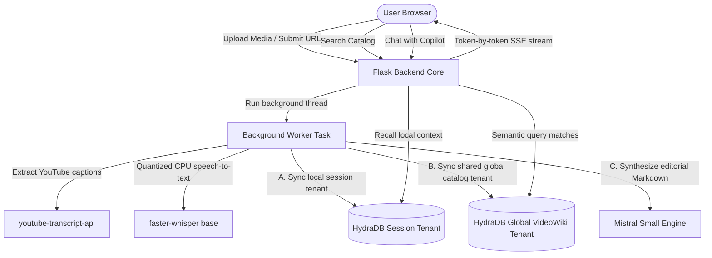

# 📖 VideoWiki — SOTA Video Wikipedia Engine

VideoWiki is a state-of-the-art, high-density video knowledge engine. It automatically transcribes and compiles YouTube videos or local media files into gorgeous, flowing Wikipedia-style editorial articles. Built with a floated InfoBox layout and a collapsing **AI Research Assistant** sidebar, VideoWiki makes video catalogs completely searchable, queryable, and readable in seconds.

---

## 🚀 SOTA Tech Stack Architecture



---

## ⚡ Setup & Ingestion Engine

### 1. Pre-requisites
Ensure you have **Python 3.9+** and `pip` installed.

### 2. Install Pin Dependencies
Execute package installations inside your terminal:
```bash
pip install -r requirements.txt
```
> [!NOTE]
> When uploading your first local MP4, MP3, or WAV file, the system will trigger a one-time automated download of the standard local `faster-whisper` "base" model (~150MB).

### 3. Key Credentials (`.env`)
Fill in your details in `.env`:
```ini
MISTRAL_API_KEY=your_mistral_api_key
HYDRADB_API_KEY=your_hydradb_api_key
FLASK_SECRET_KEY=super_secret_videomind_key_1298471
FLASK_ENV=development
DATABASE_URL=sqlite:///videomind.db
```
*(A pre-configured `.env` is already present and set up in your workspace!)*

### 4. Fire Up the Portal
Run the Flask application server:
```bash
python app.py
```
Open **[http://127.0.0.1:5000](http://127.0.0.1:5000)** in your browser.

---

## 🧠 SOTA Semantic Memory: The HydraDB Architecture

VideoWiki uses a advanced dual-layered vector indexing architecture powered by **HydraDB** to unlock both local deep-dives and global cross-video search:

### 1. Local Session Isolated Tenants (`session_id` tenant)
*   **Context Isolation**: Each individual video is registered with a dedicated, isolated UUID tenant on HydraDB.
*   **Focused Memory**: Chat queries made inside a specific article are matched solely against that video's transcript chunks. This prevents semantic leaks and keeps the AI copilot highly focused.

### 2. Global Shared Catalog Tenant (`global_videowiki_tenant` tenant)
*   **Cross-Video Semantic Index**: Transcript slices from *every* successfully indexed video are cataloged in a shared multi-video index.
*   **Search Engine Capabilities**: Entering a query into the global homepage search box semantically retrieves relevant moments from across the entire video catalog, complete with clickable links that take you directly to those specific video pages!

---

## 🛡️ Robust Fail-Safe Design

VideoWiki is built to guarantee a bulletproof user experience even during API outages or background task delays:

*   **Failsafe On-The-Fly Article Compilation**: If a user clicks an older session where article synthesis wasn't fully completed, the backend instantly compiles a beautiful structured Wikipedia-style article in ~2 seconds using `mistral-small-latest` and caches it in the SQLite database before rendering. No empty states, ever!
*   **Offline Context Windowing**: If HydraDB becomes unreachable or rate-limited, the AI Research Assistant automatically falls back to an offline windowing algorithm. It extracts the densest section of the transcript, and feeds it directly into Mistral to maintain a high-quality conversation without interruption.

---

## 💎 Elite Design System & Editorial Layouts

VideoWiki's user experience matches the quality of a world-class, premium publishing portal:

*   **Wolfram-style Wikipedia Portal**: Homepage features high-contrast logo glows, side-by-side symmetrical YouTube & Local upload cards, and a sleek central search dashboard with quick-click trending concept badges.
*   **Direct Editorial Article Canvas**: Main view floats a highly stylized **Quick Facts & Metadata InfoBox** inside the text, allowing the synthesized technical Markdown headers (*Executive Summary, Key Thematic Concepts, Timeline*) to wrap beautifully around it.
*   **Collapsible Research Copilot**: A right-side AI chat panel is pinned to the page. Readers can collapse the panel to read in full-screen mode, which prompts a scale-animated "**Ask Assistant**" floating button to pop up at the bottom-right for instant retrieval!
