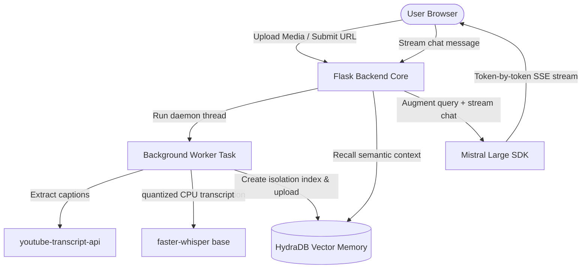

# VideoMind — Full-Stack AI Video Agent

VideoMind is a premium, high-density AI Video Agent platform that lets you ingest, transcribe, and query YouTube videos or local media files using advanced speech recognition, LLM reasoning, and conversational memory retrieval.

---

## 🚀 Tech Stack Architecture



---

## ⚡ Setup & Installation

### 1. Pre-requisites
Make sure you have **Python 3.9+** and `pip` installed on your system.

### 2. Install Dependencies
Navigate to the root directory and install the pinned packages:
```bash
pip install -r requirements.txt
```
> [!NOTE]
> The first time you upload a local audio or video file, the system will trigger a one-time automatic download of the standard `faster-whisper` "base" model (~150MB).

### 3. Environment Variables Config
Copy `.env.example` to `.env` and fill in your keys:
```ini
MISTRAL_API_KEY=your_mistral_api_key
HYDRADB_API_KEY=your_hydradb_api_key
FLASK_SECRET_KEY=generate_random_key_here
FLASK_ENV=development
DATABASE_URL=sqlite:///videomind.db
```
*(Your workspace has a pre-populated `.env` ready to run!)*

### 4. Boot Up the Server
Start the Flask development environment:
```bash
python app.py
```
Open **[http://127.0.0.1:5000](http://127.0.0.1:5000)** in your browser.

---

## 🧠 Semantic RAG Memory: The HydraDB Advantage

VideoMind implements a advanced **Retrieval-Augmented Generation (RAG)** pipeline. Instead of passing massive transcripts directly to the LLM (which runs into context window limits, slows down response speeds, and increases token costs), it offloads search index memory to **HydraDB**.

> [!IMPORTANT]
> **Why HydraDB is a game-changer for AI Agents:**
> 1. **Multi-Tenant Context Isolation**: VideoMind registers each distinct video session as an isolated *tenant index* within HydraDB (`https://api.hydradb.com/v1/tenants`). This guarantees that questions asked inside a session are semantically queried *only* against that specific video's memories—ensuring zero context leaks between videos.
> 2. **Double-Structured Memory Blocks**: HydraDB digests raw transcription texts, automatically extracts key thematic chunks, calculates semantic embeddings, and stores them in high-speed indexes.
> 3. **Sub-second Vector Recall**: When a user queries the chat, the system performs a vector search against the tenant's exact memories, recalling only the most semantically relevant snippets in milliseconds to feed as prompt context.
> 4. **Tenant Lifecycle Autonomy**: Deleting a session in VideoMind triggers a `DELETE` request, terminating the tenant and clearing out all related index memory in HydraDB to maintain a clean dataset.

### 🔍 Ingest and Retrieval Lifecycle

| Stage | Process Flow | Technology | Output |
| :--- | :--- | :--- | :--- |
| **1. Ingest** | Fetch captions or run local Whisper model | `youtube-transcript-api` / `faster-whisper` | Raw String Transcript |
| **2. Index** | Register unique UUID tenant + upload transcript memory | **HydraDB REST API** | Semantic Vector Nodes |
| **3. Query** | Perform vector similarity search for user query | **HydraDB Semantic Recall** | Curated Context Snippets |
| **4. Respond** | Stream conversational reply with recalled context | `mistral-large-latest` | Chunked SSE stream to client |

---

## 🛡️ Offline Context Fallback Resilience

If HydraDB is unreachable, undergoing maintenance, or returns a failing status, VideoMind is built to **never fail**:

> [!TIP]
> **Graceful Degradation:**
> When HydraDB is not active, the system automatically falls back to an offline local context windowing strategy. It slices a safe, dense section of the raw transcript text (~8,000 characters) and injects it directly into the Mistral system role context so the user can continue conversing uninterrupted.

---

## 💎 Premium Design System & UI Features

VideoMind is designed to feel highly premium, fluid, and reactive:

* **Editorial Dark-Light Contrast**: Sleek, immersive dark slate sidebar (`#111210`) paired with a clean, readable editorial main canvas (`#fafaf8`) using `DM Sans` typography.
* **Persistent Chat Memory**: Conversations are persistently stored in the browser's `localStorage` per session. Rerendering, closing, or refreshing the page retains full chat logs seamlessly, while deleting a session purges browser memory cleanly.
* **Typing Indicator**: Real-time 3-dot pulsing bubble transitions immediately when the LLM begins streaming tokens.
* **Adaptive Input**: Expandable prompt textarea expands vertically up to `180px` as you type multi-line instructions, complete with dynamic character counters.
* **Transcript Overlay Modal**: Instantly view the raw text in a dedicated scrollable window set in a monospace `DM Mono` developer typeface with one-click clipboard copying.
